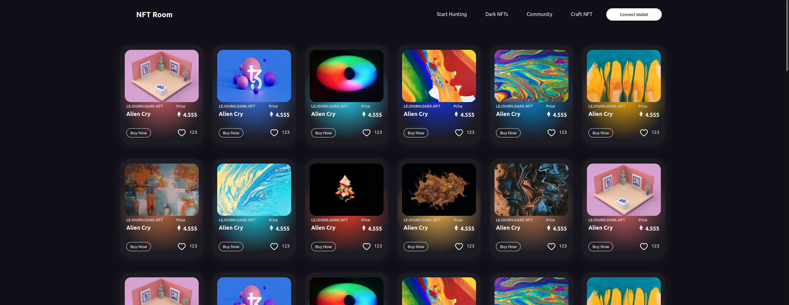

## 🖥️ Screenshoots 

### Home

### Explore

### Nft Detail

### Augmented Reality Support

# **マルチチェーンNFTマーケットプレイス**  

## **概要**  
**マルチチェーンNFTマーケットプレイス**は、ユーザーが**複数のブロックチェーン上でNFTの売買や取引をシームレスに行える**プラットフォームです。**Internet Computer Protocol（ICP）**を基盤とし、**Canisters（スマートコントラクト）**を活用した分散型ストレージと、**Internet Identity**による安全な認証を提供することで、**信頼性の高いスケーラブルなNFT取引体験**を実現します。  

## **機能**  
- **マルチチェーン統合**による**クロスチェーンNFT取引の実現**  
- **ICP Canisters**および**IPFS**による**分散型ストレージ**の提供  
- **Internet Identity**を活用した**安全でシームレスな認証**  
- **ICP技術を活用**した**低コストかつ効率的なトランザクション**の実現  
- **Web2ユーザーフレンドリーなUI**と**Web3機能**の両立  

## **解決する課題**  
現在のNFTマーケットプレイスは**単一のブロックチェーンに依存**しており、**流動性の低下やエコシステムの分断**が課題となっています。本プラットフォームは**複数のブロックチェーンを接続**し、**異なるネットワーク間でNFTを取引**できる環境を提供することで、**分散型の所有権、相互運用性、およびセキュリティを確保**します。  

## **課題と挑戦**  
- **クロスチェーン互換性**：異なるブロックチェーン間のシームレスなトランザクションの実装  
- **スマートコントラクトの最適化**：ICPの**Canisters**を活用し、高速な処理を維持  
- **ユーザーエクスペリエンス**：Web2とWeb3の使いやすさを両立させるUI設計  
- **トランザクションコストの最適化**：ガス代の管理と各ネットワークでの手数料最適化  

## **使用技術**  
- **Internet Computer Protocol（ICP）** – **Canisters（スマートコントラクト）**および**Internet Identity（認証）**  
- **React.js & Styled-Components** – フロントエンド開発とUI/UX設計  
- **UsedApp & Web3.js** – ブロックチェーンとの連携  
- **IPFS/ICPストレージ** – 分散型NFTメタデータの保存  
- **マルチチェーン統合** – 複数のブロックチェーンでのNFT取引を可能にする技術  

## **開発プロセス**  
1. **スケーラビリティ・セキュリティ・相互運用性を考慮したアーキテクチャ設計**  
2. **React.jsを使用したモダンなUI/UX設計のフロントエンド開発**  
3. **Canistersを活用した分散型バックエンドロジックの実装**  
4. **ブロックチェーンブリッジとカスタムスマートコントラクトによるマルチチェーン互換性の実現**  
5. **ガス代削減とトランザクション速度の最適化**  

## **学んだこと**  
- **マルチチェーン取引とブロックチェーン相互運用性の複雑さ**  
- **ICP Canistersの最適なスマートコントラクト実装**  
- **Web2とWeb3の融合によるユーザーエクスペリエンス向上**  
- **NFT取引におけるセキュリティ対策の重要性**  

## **今後の展開**  
✅ **対応するブロックチェーンを拡張し、NFT市場の流動性を向上**  
✅ **プログラム可能な所有権やオンチェーンロイヤリティを持つダイナミックNFTの導入**  
✅ **DAO統合による分散型ガバナンスの強化**  
✅ **トランザクション手数料を最適化し、よりコスト効率の良い取引を実現**  
✅ **モバイル対応を進め、より多くのユーザーにリーチ**  

---

🔗 **ライブデモ:** [ここをクリック](https://icp-nftmarketplace.netlify.app/)  
📂 **GitHubリポジトリ:** [GitHub](https://github.com/Thycrescendo/Icp-Nft-Marketplace.git)  
